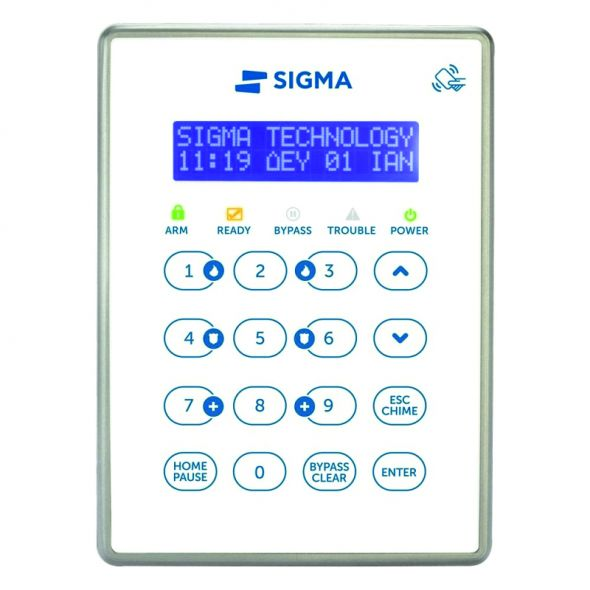
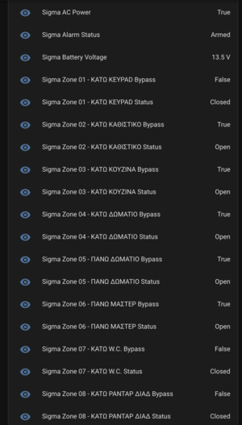
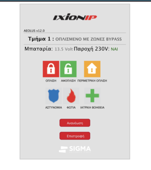

# Sigma Alarm Integration for Home Assistant

This custom integration adds support for **Sigma alarm systems**, with the Ixion addon(IP) in Home Assistant.

It communicates with the alarm panel through HTTP requests and HTML parsing (web scraping), providing real-time insight into the panel's status and zones, as well as the ability to arm/disarm the system.

## Features

- **Alarm status**: Armed, Disarmed, or Perimeter Armed
- **Arming/Disarming**: Full support for Away and Stay modes
- **Bypassed zones**: Clearly indicates which zones are bypassed
- **Zone sensors**: Open/Closed state per zone + bypass state
- **Battery voltage** and **AC power** monitoring

-

## Installation

### Option 1: HACS (Recommended)

1. Go to **HACS > Integrations > ⋯ > Custom Repositories**
2. Add this repository: `https://github.com/phoinixgrr/sigma_connect_ha`
3. Category: **Integration**
4. Click **Add**
5. Then search for **Sigma Alarm** and install it

### Option 2: Manual

1. Copy the folder `custom_components/sigma_connect_ha/` to your Home Assistant `custom_components/` directory
2. Restart Home Assistant

## Configuration

1. Go to **Settings > Devices & Services**
2. Click **Add Integration**
3. Search for **Sigma Alarm**
4. Enter your:
   - Alarm Panel IP address
   - Username
   - Password

## Settings

After adding the integration, you can go to **Settings → Devices & Services → Sigma Alarm → Configure** to adjust:

| Option                   | Default | Description                                                 |
|--------------------------|:-------:|-------------------------------------------------------------|
| **Alarm PIN**            | —       | Keypad code (if different from web password)                |
| **Polling Interval**     | 10 s    | How often Home Assistant checks the panel status            |
| **Send Analytics**       | On      | Send anonymous usage statistics to help improve the integration |

> **Note:** A restart of Home Assistant is required for changes to take effect.

## How It Works

Sigma does not offer a public or documented API. This integration operates via **HTML scraping**, similar to how you would inspect your alarm panel via your browser.

We reverse-engineered the web interface used by the alarm's IP module:
- Captured the requests and tokens during login from the browser’s developer tools
- Reconstructed the flow in Python
- Submit credentials through encrypted payloads
- Select partitions and extract real-time data from plain HTML (status, zones, battery, etc.)

## Notes

- Your Home Assistant instance must be able to communicate with the Alarm IP.
- Sigma systems support IP connectivity via an additional network module: [https://sigmasec.gr/ixion-ip](https://sigmasec.gr/ixion-ip)
- Supports **full read/write** functionality:
  - Arm (Away)
  - Arm (Stay/Perimeter)
  - Disarm
- Tested with **Ixion v1.3.9** and:
  - **AEOLUS v12.0**
  - **S-PRO 32**
- ⚠️ No guarantees for other firmware versions.
- This is still in beta form. Your mileage will vary! 

## Security & Token Handling (Deep Dive)

Sigma alarm systems implement a custom **token-based challenge-response mechanism** during login, along with a **session-based authorization model** for subsequent interactions. Although no public API exists, we reverse-engineered the system by inspecting its web interface and mimicking browser behavior in Python.

### Discovery & Reverse Engineering

Sigma does not document any API. To build this integration, we reverse-engineered its IP module web interface:

- Using browser developer tools, we captured traffic to:
  - Identify the `gen_input` **login token**
  - Observe the JavaScript-based **encryption algorithm**
  - Track HTML-based workflows for zone status, PIN entry, and partitions

- The JavaScript-based encryption was reverse-engineered and replicated in Python. This allowed us to authenticate programmatically, just like the browser does.

### How Login & Token-Based Encryption Works

1. **GET /login.html** returns a one-time token in a hidden input field (`gen_input`).
2. A JavaScript function encrypts the user’s password using that token.
3. The browser submits:
   - `username`
   - `encrypted password` (hex)
   - `gen_input` (length of encrypted string)
4. The server verifies the password by reproducing the exact same encryption steps.

We ported this exact logic to Python to simulate browser behavior headlessly.

### Post-Login Session Behavior

Once logged in:

- The panel issues a **session cookie** (e.g. `SID=...`)
- This cookie is used for all subsequent interactions (e.g. viewing panel status, arming/disarming)
- The session remains valid for a period of time, or until logout

⚠️ All control actions depend entirely on this cookie being present and valid.

### Brute-Forcing Hidden Control Endpoints

Sigma's frontend **does not expose** any official control buttons (e.g., arm/disarm). However, after logging in, we began **probing common paths** and discovered undocumented endpoints like:

- `/arm.html` – Arms the system (Away)
- `/stay.html` – Arms perimeter/stay
- `/disarm.html` – Disarms the system
- `/done.html` – Shows a Hidden Menu 

-

These endpoints are not visible in the UI, but respond with a `200 OK` and successfully execute the command when accessed by a logged-in session.
( More may exist, feel free to reachout 😎 ) 

## Security Considerations

| Feature / Mechanism         | Status                            |
|-----------------------------|------------------------------------|
| Token replay protection     | ✅ One-time use per login           |
| Password protection         | ⚠️ Obfuscated, not securely encrypted |
| HTTPS/TLS                   | ❌ Not supported                    |
| Session hijack protection   | ❌ Not protected if cookie leaked   |
| Authenticated API access    | ❌ None — only via UI scraping      |

### Recommendations

- **DO NOT expose your alarm system to the public internet**
- Keep it on a secure VLAN or local-only network
- Never trust Sigma’s web interface for critical security boundaries — treat it as legacy
- Avoid shared/public Wi-Fi unless you’ve isolated communication via VPN or encrypted tunneling

##  Note on Web Interface Conflicts

While the Sigma integration is active and connected in Home Assistant, the alarm panel's web interface (login.html) may continuously log you out or prevent login. This is most likely due to the panel allowing only one active session per set of credentials.

To access the alarm’s web interface manually, **you will need to temporarily disable the Sigma integration in Home Assistant**. Once you're done using the web interface, you can re-enable the integration. 

## Feedback

Found a bug or need a feature? Open an issue or PR in the [GitHub repository](https://github.com/phoinixgrr/sigma_connect_ha)

## 🐣 Easter Egg

This project was developed as a hobby project during **Greek Easter 2025** — which is why you might notice a few symbolic red Easter eggs baked into the logo 🥚🇬🇷.

It’s a little nod to the timing of the project and a reminder that tech and tradition can happily coexist ✨

## Anonymous Analytics

This integration can optionally send a one-time anonymous report with basic system and config info (no personal data) to help improve the integration.
Disable it anytime from the "Enable analytics reporting" option in settings.

## ☕ Support My Work

If you find this project helpful and want to support my work, feel free to donate via PayPal:

[https://paypal.me/amaziotis](https://paypal.me/amaziotis)
