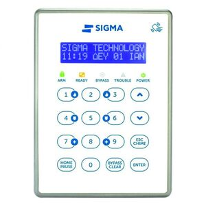

# Sigma Alarm Integration for Home Assistant

This custom integration adds support for **Sigma Ixion alarm systems** in Home Assistant.

It communicates with the alarm panel through HTTP requests and HTML parsing (web scraping), providing real-time insight into the panel's status and zones, as well as the ability to arm/disarm the system.
-

---

## Features

- **Alarm status**: Armed, Disarmed, or Perimeter Armed
- **Arming/Disarming**: Full support for Away and Stay modes
- **Bypassed zones**: Clearly indicates which zones are bypassed
- **Zone sensors**: Open/Closed state per zone + bypass state
- **Battery voltage** and **AC power** monitoring

-

---

## Installation

### Option 1: HACS (Recommended)

1. Go to **HACS > Integrations > ⋯ > Custom Repositories**
2. Add this repository: `https://github.com/phoinixgrr/sigma_connect_ha`
3. Category: **Integration**
4. Click **Add**
5. Then search for **Sigma Alarm** and install it

### Option 2: Manual

1. Copy the folder `custom_components/sigma_alarm/` to your Home Assistant `custom_components/` directory
2. Restart Home Assistant

---

## Configuration

1. Go to **Settings > Devices & Services**
2. Click **Add Integration**
3. Search for **Sigma Alarm**
4. Enter your:
   - Alarm Panel IP address
   - Username
   - Password

---

## How It Works

Sigma does not offer a public or documented API. This integration operates via **HTML scraping**, similar to how you would inspect your alarm panel via your browser.

We reverse-engineered the web interface used by the alarm's IP module:
- Captured the requests and tokens during login from the browser’s developer tools
- Reconstructed the flow in Python
- Submit credentials through encrypted payloads
- Select partitions and extract real-time data (status, zones, battery, etc.)

This is a **security-by-obscurity** model on Sigma’s end. No real API is provided, and all logic relies on the undocumented web frontend.

---


---

## Security & Token Handling

Sigma alarm systems use a **token-based challenge-response mechanism** for login, but without HTTPS or other strong cryptographic transport. The token is embedded in the login form as an HTML field, and the alarm panel expects a derived password response using this token.

Since Sigma does not expose an official API, the integration extracts this token by scraping the HTML login page. It then reproduces the exact JavaScript encryption logic (from the browser) in Python and submits the generated encrypted password.

This behavior is a form of **security by obscurity**. While it adds some obfuscation, it provides limited real-world protection — especially as communication happens over plain HTTP. Therefore, for your own security:
- Ensure your alarm system is **not exposed to the internet**.
- Keep Home Assistant on a secure, trusted local network.

## Notes

- Your Home Assistant instance must be able to communicate with the Alarm IP.
- Sigma systems support IP connectivity via an additional network module: [https://sigmasec.gr/ixion-ip](https://sigmasec.gr/ixion-ip)
- Supports **full read/write** functionality:
  - Arm (Away)
  - Arm (Stay/Perimeter)
  - Disarm
- Tested with:
  - **AEOLUS v12.0** — Sigma alarm control panel
  - **S-PRO 32** — Sigma alarm control panel
  - **Ixion v1.3.9** — Sigma IP communication module used for integration
- ⚠️ No guarantees for other firmware versions.
- It is still in alpha form. Chances of working in your system are slim.

---

## Directory Structure

```
custom_components/sigma_alarm/
├── __init__.py
├── alarm_control_panel.py
├── config_flow.py
├── const.py
├── coordinator.py
├── manifest.json
├── sensor.py
├── sigma_client.py
├── strings.json
└── translations/
    └── en.json
```

---

## To-Do / Planned

-- [x] Add arming/disarming support via alarm control panel entity
-- [ ] More robust error handling & retries
-- [ ] Better multi-partition(system 1/system2) support (if available)

---

## Feedback

Found a bug or need a feature? Open an issue or PR in the [GitHub repository](https://github.com/phoinixgrr/sigma_connect_ha)

---

## ☕ Support My Work

If you find this project helpful and want to support my work, feel free to donate via PayPal:

[https://paypal.me/amaziotis](https://paypal.me/amaziotis)
